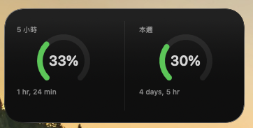
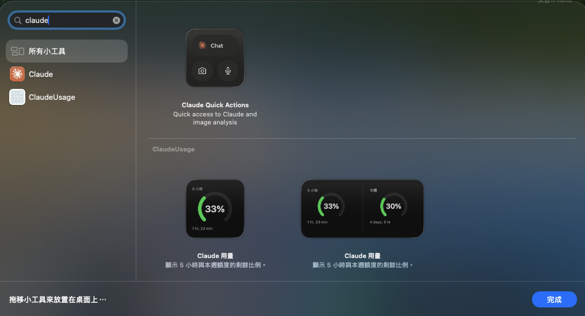

# claude-usage-widget

macOS 選單列 app + 桌面小工具，顯示 Claude 訂閱額度用掉多少。



## 安裝

需要 macOS 14 以上，以及**完整版 Xcode**（只有 Command Line Tools 不夠）。

```sh
curl -fsSL https://raw.githubusercontent.com/echoulen/claude-usage-widget/main/install.sh | bash
```

腳本會從原始碼建置後裝到 `/Applications` 並啟動。第一次會出現三個系統對話框，都按同意：建立本機簽章憑證、讀取 Claude Code 的登入憑證、寫入小工具資料。

安裝會一併設定隨系統登入自動啟動 —— 這是常駐監看工具該有的行為。不想要的話加 `--no-login-item`，但要知道代價：app 不會隨系統啟動，**重開機或登出之後它就停了**，而桌面小工具會繼續顯示最後一次的數字（標「已凍結」），看起來像還在運作。

其他選項見 `--help`。

## 把小工具放上桌面

桌面按右鍵 →「編輯小工具」→ 搜尋 `claude` → 選 **ClaudeUsage**，把想要的尺寸拖到桌面。



## 畫面上看到什麼

**5 小時**是最常撞到的滾動視窗，**本週**是 7 天視窗，兩者各自計算、各自重置。

- **百分比**是**已經用掉**的比例，環也隨用量填滿 —— 環快滿了就是快到上限了
- 下方是**距離重置還有多久**，由系統自己每秒更新
- 環的顏色：<60% 綠、60–84% 橘、≥85% 紅

選單列同時顯示一個小環加數字（5 小時視窗），點開可以看到兩個視窗、手動重新整理。

數字以官方 API 為準，兩次查詢之間會用本機 `~/.claude/projects` 的 token 量做推估，標示「推估中」。如果 API 連不上，會凍結最後一次官方數字並標示「已凍結」，不會拿本機資料湊一個新數字給你。視窗過了重置時間就顯示 `—`，不會沿用舊值。

### 看不到顏色？

macOS 預設會把桌面小工具調暗成灰階。這是系統設定，不是 app 的：

```
系統設定 → 桌面與 Dock → 「讓桌面上的小工具變暗」→ 選「永不」
```

## 已知限制

- Keychain 授權對話框大約每 8 小時會再跳一次 —— Claude Code 刷新 token 時連帶造成的，不在本專案控制範圍
- 小工具尺寸由 WidgetKit 規定，只有那幾種，做不出貼齊 Dock 高度的窄長條

## 為什麼不用 App Group

一般 app 與小工具之間是靠 App Group 共享容器傳資料，這個專案不行 —— 實測發現在 ad-hoc 簽章（無付費 Apple Developer team）下，被 sandbox 的小工具對 App Group 容器的讀、列目錄、寫入全部被系統拒絕（`NSCocoaErrorDomain` 257 / 513）。改用付費 team 也救不回來：`xcodebuild` 在命令列從未真正配出 App Group 的 provisioning profile，而沒有 profile 的 extension 會卡在 `_libsecinit_appsandbox` 被系統強制終止。

可行的做法是寫進**小工具自己的 sandbox 容器**：host app 刻意不進 sandbox，所以能用一般權限寫進去，而小工具讀自己的容器不需要任何 entitlement。同一次診斷中，讀自有容器成功、讀 App Group 失敗，這就是選它的依據。

## 移除

```sh
curl -fsSL https://raw.githubusercontent.com/echoulen/claude-usage-widget/main/install.sh | bash -s -- --uninstall
```

在既有的 clone 內則是 `./install.sh --uninstall`。

會移除 app 與 LaunchAgent；小工具的資料容器與本機簽章憑證**不會**自動刪除，腳本會印出位置讓你自行決定。

## 授權

MIT — 見 [LICENSE](LICENSE)。
